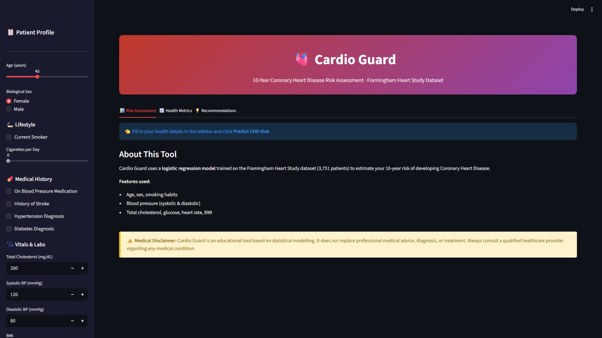
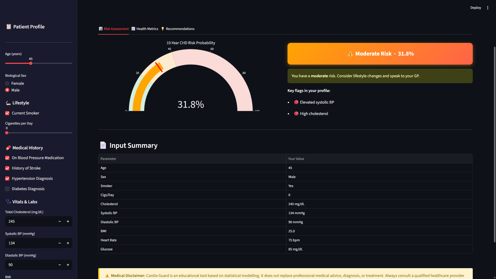
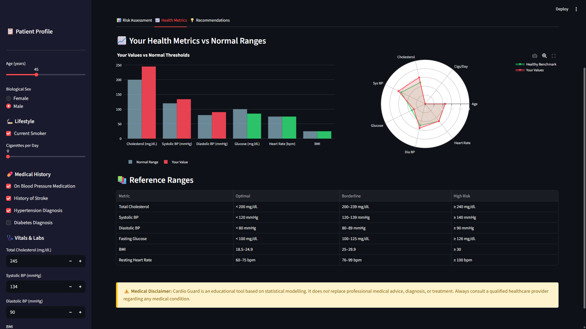
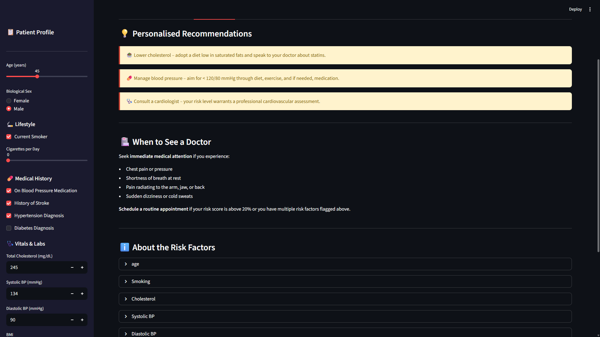
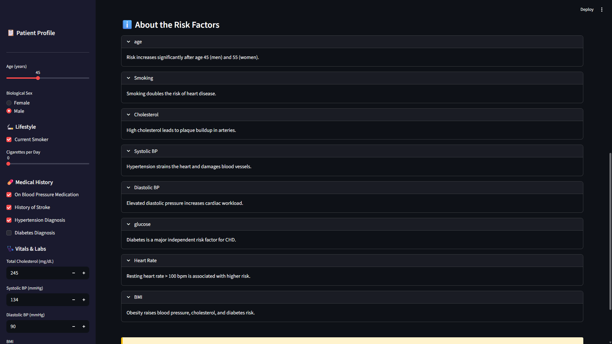

# 🫀 Cardio Guard

Cardio Guard is a production-grade machine learning application designed to predict the 10-year risk of Coronary Heart Disease (CHD). Powered by a refined clinical pipeline trained on the historic **Framingham Heart Study** dataset, the project combines an optimized backend script with an interactive Streamlit frontend for seamless visualization.

---

## 📈 Model Training Performance Summary

The pipeline evaluates both a regularized **Logistic Regression** model and a **Gradient Boosting Classifier** challenger. 

### 🏆 Preferred Model Selection
**Logistic Regression** was selected as the final production model over Gradient Boosting. While tree-based ensembles like Gradient Boosting are highly capable of capturing complex non-linear combinations, they heavily overfit the minority class on this specific tabular dataset, even when balanced using SMOTE. 

Logistic Regression—bolstered by engineered linear interaction terms—demonstrated superior generalization and stability, achieving a significantly higher test ROC-AUC.

### ⚙️ Pipeline Configurations
* **Selected Model:** Logistic Regression (`C=0.01`, `penalty='l2'`, `solver='liblinear'`)
* **Class Imbalance Strategy:** SMOTE (Synthetic Minority Over-sampling Technique)
* **Cross-Validation Scoring:** Stratified 5-Fold CV (`AUC: 0.7481`)
* **Final Evaluation Metric:** Test ROC-AUC of **`0.7018`** *(Outperformed Gradient Boosting's `0.6364`)*

### 🔍 Clinical Threshold Tuning (0.50 vs 0.30)
In medical diagnostics, missing a true high-risk patient (False Negative) is significantly more dangerous than flagging a healthy patient for extra testing (False Positive). Therefore, the system incorporates a **tuned clinical threshold of 0.30** to optimize for **Recall**:

| Metric (CHD Class) | Standard Threshold (0.50) | Tuned Threshold (0.30) | Clinical Impact |
| :--- | :---: | :---: | :--- |
| **Recall (Sensitivity)** | 63% | **91%** | **Catches 9 out of 10** actual CHD cases. |
| **Precision** | 26% | 20% | Trade-off: Higher rate of follow-up validation required. |
| **Overall Accuracy** | 66.8% | 41.6% | Lowered globally to aggressively defensive safety settings. |

#### Tuned Threshold Confusion Matrix
* **True Negatives (Correctly identified healthy):** 260
* **False Positives (Flagged for clinical review):** 535
* **False Negatives (Missed cases):** **Only 13**
* **True Positives (Correctly flagged high-risk):** 130

---

## 🛠️ Engineered Features

To improve linear predictability, the training script constructs **11 mathematical features** from the raw inputs prior to scaling:
1. `pulse_pressure`: $Systolic\ BP - Diastolic\ BP$ (Key cardiovascular stiffness marker)
2. `MAP`: Mean Arterial Pressure $\rightarrow Diastolic\ BP + \frac{Pulse\ Pressure}{3}$
3. `chol_glucose_ratio`: Ratio of Total Cholesterol to Fasting Glucose
4. `age_x_cigs`: Compounding interaction feature between Age and Smoking frequency

---

## 🖥️ Streamlit App Walkthrough & Interface Guide

This section explains how to navigate the interactive dashboard and outlines the technical operations happening behind the scenes.



### 📥 1. Patient Profile Inputs (Sidebar)
The user inputs clinical data via the interactive sidebar. The fields are split into three logical categories:
* **Demographics:** Age slider and Biological Sex.
* **Lifestyle:** Interactive smoking toggles. If **"Current Smoker"** is unchecked, the daily cigarette slider is programmatically locked to `0` to prevent messy input data.
* **Vitals & Labs:** Numeric fields for Total Cholesterol, Blood Pressure (Systolic/Diastolic), BMI, Heart Rate, and Fasting Glucose.

---

### 🗂️ 2. Tabbed Architecture Explained

The dashboard processes and displays your prediction across three functional sections:

#### Tab 1: 📊 Risk Assessment
This tab handles the primary machine learning execution. 
* Clicking **"Predict CHD Risk"** triggers data extraction, applies feature transformations, standardizes scales using `scaler.pkl`, and runs the tuned Logistic Regression model.
* **Visuals:** A Plotly gauge chart dynamically shifts colors based on risk severity (Green for Low, Orange for Moderate, Red for High).
* **Clinical Flags:** Below the gauge, a dynamic checking script scans your inputs against medical cut-offs to flag specific high-risk elements (e.g., highlighting if Systolic BP > 130 mmHg).



#### Tab 2: 📈 Health Metrics
Designed for patient feedback and engineering audit logs.
* **Comparative Bar Chart:** An interactive Plotly bar chart visually contrasts the patient's vitals against standard normal clinical thresholds.
* **Normalized Radar Chart:** Uses a custom multi-axis radar layout to map out where the patient sits relative to a healthy benchmark profile.
* **Model Insights Expander:** A drop-down menu that reads the static `roc_curve.png` and `feature_importance.png` files generated during model training, allowing users to audit the pipeline without digging into terminal directories.



#### Tab 3: 💡 Recommendations
A rule-based medical safety engine that interprets the prediction outputs and raw data inputs.
* Generates clear, customized lifestyle guidelines depending on what parameters triggered risk flags (e.g., displaying custom cardiovascular advice if a user is a smoker or has high fasting blood sugar).
* Provides explicit risk escalation warnings highlighting when a patient should seek immediate medical attention or schedule a routine specialist consultation.




---

## 🛠️ How the App Works: Under the Hood

When a user clicks the **Predict** button, the data moves through a strict 4-stage pipeline before rendering on the screen:

```text
[1. User Input Raw Dictionary]
              │
              ▼
[2. Real-Time Feature Engineering Transforms]
    • pulse_pressure = sys_bp - dia_bp
    • MAP = dia_bp + (pulse_pressure / 3)
    • chol_glucose_ratio = tot_chol / (glucose + 1)
    • age_x_cigs = age * cigs_per_day
              │
              ▼
[3. Standard Z-Score Vector Scaling via scaler.pkl]
    • Z = (x - mean) / std_dev
              │
              ▼
[4. Model Sigmoid Array Mapping via cardio_guard_model.pkl]
    • Computes probability P(CHD)
    • If P(CHD) >= 0.30 ──> Trigger Defensive High-Risk UI Alert
```

---


## 📦 Project Structure

```text
├── assets/                     # App screenshots linked inside this README
│   ├── app_overview.png
│   ├── tab1_risk_assessment.png
│   ├── tab2_health_metrics.png
│   └── tab3_recommendations.png
├── models/
│   ├── cardio_guard_model.pkl  # Wrapped dict containing model, features & threshold
│   ├── scaler.pkl              # Fitted StandardScaler instance
│   ├── training_report.txt     # Complete classification reports
│   ├── roc_curve.png           # Visual performance curve
│   └── feature_importance.png  # Absolute coefficients plot
├── app.py                      # Clean Streamlit user interface (3-tab deployment)
├── train_model.py              # Training pipeline with SMOTE & Hyperparameter tuning
├── framingham.csv              # Source dataset (3,751 rows post-cleaning)
└── README.md                   # Project documentation